# Tugas Praktikum { Pertemuan ke 6 } 


|**Nama**|**NIM**|**Kelas**|**Matkul**|
|----|---|-----|------|
|Muhammad Ikhsan Fakhrudin|312210019|TI.22.A2|Basis Data|

# Soal Latihan Praktikum

Berdasarkan table Mahasiswa pada praktikum sebelumnya: (nim, nama, jenis_kelamin, tgl_lahir, jalan, kota, kodepos, no_hp, kd_ds)

***Isi data pada table tersebut sebanyak minimal 5 record data. Tampilkan semua isi/record tabel!***

- Ubah data tanggal lahir mahasiswa yang bernama Ari menjadi: 1979-08-31!

- Tampilkan satu baris / record data yang telah diubah tadi yaitu record dengan nama Ari saja!

- Hapus Mahasiswa yang bernama Dina!

- Tampilkan record atau data yang tanggal kelahirannya lebih dari atau sama dengan 1996-1-2!

- Tampilkan semua Mahasiswa yang berasal dari Bekasi dan berjenis kelamin perempuan!

- Tampilkan semua Mahasiswa yang berasal dari Bekasi dengan kelamin laki-laki atau Mahasiswa yang berumur lebih dari 22 tahun dengan kelamin wanita!

- Tampilkan data nama dan alamat mahasiswa saja dari tabel tersebut

- Tampilkan data mahasiswa terurut berdasarkan nama.

**1. Mengisi tabel dengan minimal 5 record data :**
```
insert into mahasiswa (nim, nama, jenis_kelamin, tgl_lahir, jalan, kota, kodepos, no_hp, kd_ds) values 
-> (11223344,"ari santoso","Laki-laki","1998-10-12","","Bekasi","","",""), 
-> (11223345,"ario talib","Laki-laki","1999-11-16","","Cikarang","","",""), 
-> (11223346,"dina marlina","Perempuan","1997-12-01","","Karawang","","",""), 
-> (11223347,"lisa ayu","perempuan","1996-01-02","","Bekasi","","",""), 
-> (11223348,"tiara wahidah","perempuan","1980-02-05","","Bekasi","","",""), 
-> (11223349,"anton sinaga","laki-laki","1988-03-10","","Cikarang","","","");
```

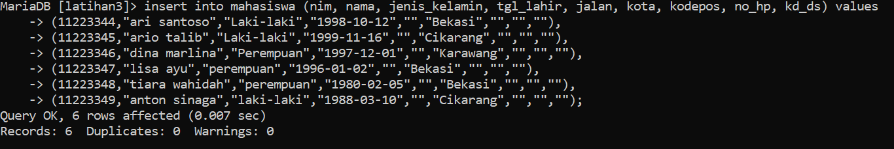

**2. Menampilkan semua isi/record pada tabel bisa menggunakan kode berikut :**

`select*from mahasiswa;`

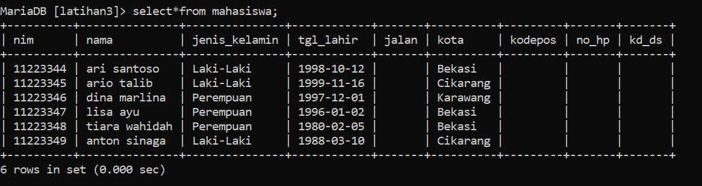

**3. Mengubah data tanggal lahir mahasiswa yang bernama Ari menjadi : 1979-08-31 menggunakan kode berikut :**

`update mahasiswa set tgl_lahir='1979-08-31' where nim=11223344;`

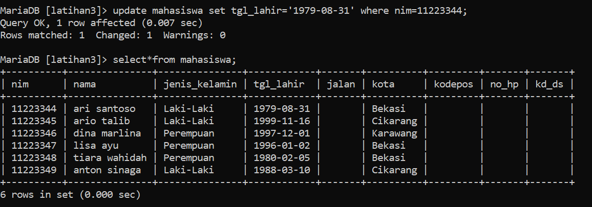

**4. Menampilkan satu baris / record data yang telah diubah tadi yaitu record dengan nama Ari saja dengan cara sebagai berikut :**

`select*from mahasiswa where nim=11223344;`

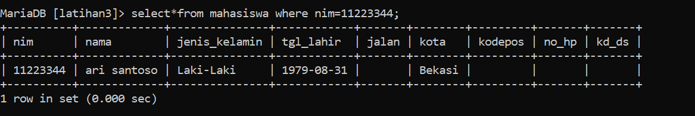

**5. Menghapus Mahasiswa yang bernama Dina dengan cara sebagai berikut:**

`delete from mahasiswa where nim=11223346;`

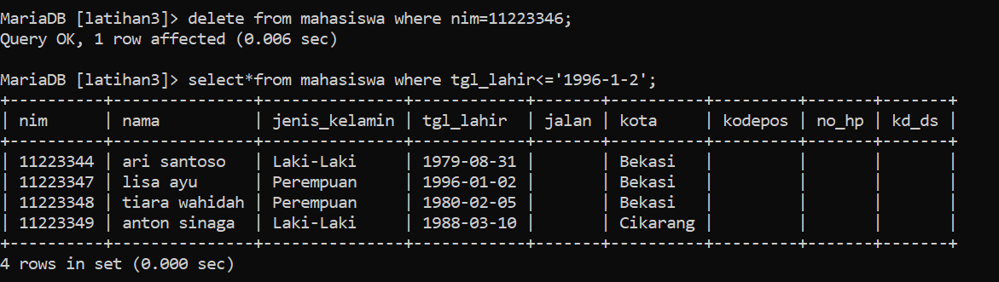

**6. Menampilkan record atau data yang tanggal kelahirannya lebih dari atau sama dengan 1996-1-2 dengan cara sebagai berikut :**

`select*from mahasiswa where tgl_lahir<='1996-1-2';`

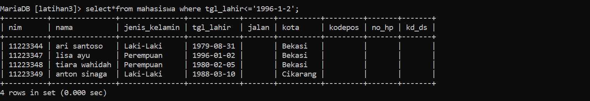

**7. Menampilkan semua Mahasiswa yang berasal dari Bekasi dan berjenis kelamin perempuan dengan cara sebagai berikut :**

`select * from mahasiswa where kota='bekasi' and jenis_kelamin='Perempuan';`

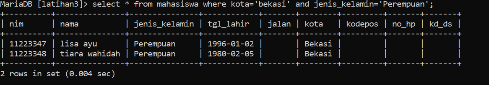

**8. Menampilkan semua Mahasiswa yang berasal dari Bekasi dengan kelamin laki-laki atau Mahasiswa yang berumur lebih dari 22 tahun dengan kelamin wanita dengan cara sebagai berikut :**
```
select * from mahasiswa where kota='Bekasi' and jenis_kelamin='Laki-laki' 
or tgl_lahir<='1997-01-02' 
and jenis_kelamin='Perempuan';
```

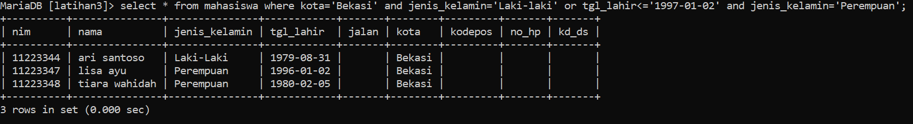

**9. Menampilkan data nama dan jalan mahasiswa saja dari tabel tersebut dengan cara sebagai berikut :**

`select nama, jalan from mahasiswa;`

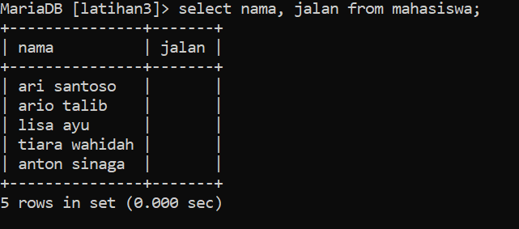

**10. Menampilkan data mahasiswa terurut berdasarkan nama dengan cara sebagai berikut :**

`select * from mahasiswa -> order by nama asc;`

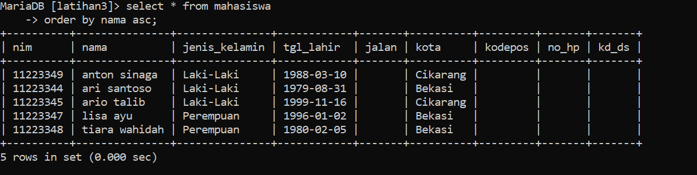

# Evaluasi dan Pertanyaan

***Tulis semua perintah-perintah SQL percobaan di atas beserta outputnya!***

**1. Menambah data :**

`INSERT INTO <table> (field1, ..., fieldn) VALUE (value1, ..., valuen)`

*Contoh :*

`INSERT INTO biodata (nim, nama, alamat) VALUE ('1234','Rio','Bekasi');`

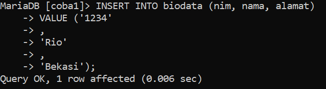

**2. Menampilkan data :**

`SELECT * FROM <table> SELECT [field1, ..., fieldn] FROM <table>`

*Contoh :*

`select * from biodata;`

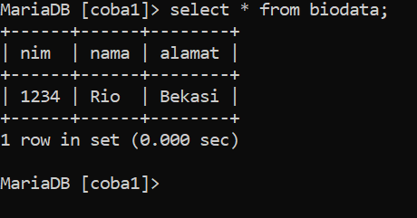

**3. Mengubah data :**

`UPDATE <table> SET field1=val1, ..., fieldn=valn WHERE <kondisi>`

*Contoh :*

`UPDATE biodata SET nama='Rio', alamat='Bekasi' where nim='12334`

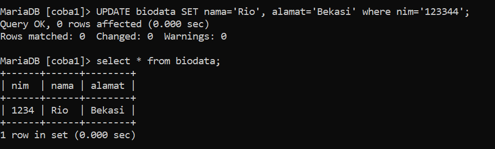

**4. Menghapus data :**

`DELETE FROM <table> WHERE <kondisi>`

*Contoh :*

`DELETE FROM biodata WHERE nim=‘12334’`

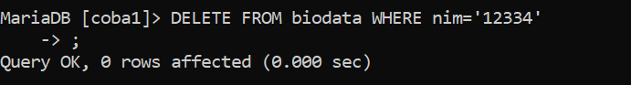

***Apa bedanya penggunaan BETWEEN dan penggunaan operator >= dan <= ?***

- (misal: tgl_lahir BETWEEN '1990-10-10' AND '1992-10-11')

- (misal: tgl_lahir >= '1990-10-10' AND tgl_lahir <= '1992-10-11')

**Jawaban nya :**

Operator between ini untuk menangani operasi “jangkauan” sedangkan operator >= dan <= termasuk pada operator relasional. Operator yang digunakan yntuk perbandingan antara dua buah nilai. Jenis dari operator ini adalah: = , >, <, >=, <=, <>

***Berikan kesimpulan anda!***

Data Manipulation Language (DML) adalah bahasa pemrograman yang digunakan untuk mengakses, memanipulasi, dan mengelola data dalam sebuah database. DML memungkinkan pengguna untuk melakukan operasi seperti penyisipan data baru, pembaruan data yang sudah ada, penghapusan data, dan kueri data untuk pengambilan informasi yang diperlukan.

Dalam DML, pengguna dapat menggunakan perintah SQL (Structured Query Language) untuk mengakses data. SQL adalah bahasa standar untuk mengakses dan mengelola data dalam database relasional. Perintah SQL yang digunakan dalam DML termasuk menambah, mengubah, menghapus, dan menampilkan data seperti yang telah dipraktekan diatas.

***Buat laporan praktikum yang berisi, langkah-langkah praktikum beserta screenshot yang sudah dilakukan dalam bentuk dokumen.***

## Finish....